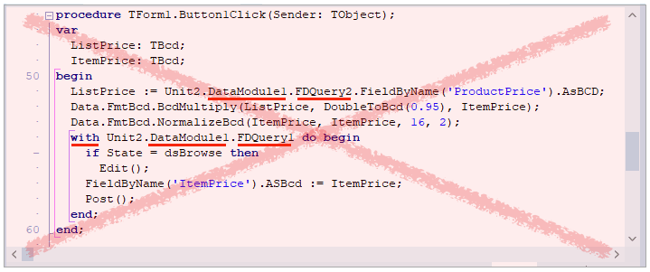
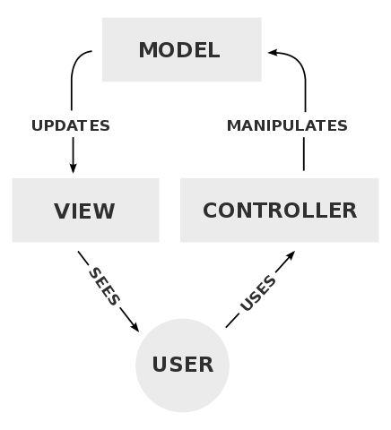

# Dobre praktyki programowania

## 1. Praca zespołowa

* Zostawiajcie ślad po tym co zrobiliście
	* Wspólne repozytorium
	* Przy całodziennym kodowaniu - min. 10 rewizji (commit-ów)
* Organizujcie zespół programistyczny i planuj wspólną pracę
	* Wewnętrzny system działu programistycznego
	* `GitHub`, `GitLab`, `Jira` etc.
	* Co potrzebujecie:
		* `Backlog`, Tablica (`Board`), `Release-y`, `Issues`, Dyskusje, CI (`Continuous Integration`)
		* Niezależność od marketingu, sprzedaży, zarządu i działu wsparcia klienta
	* Systemy rejestracji błędów nie nadają się do tego celu
		* `Bugzilla`, `Mantis`, itp.
	* Systemy helpdesk-owe nie nadają się to tego celu
		* `Zendesk`, `Freshdesk`, `ZOHO desk`, `Jira Service Desk`, itd.
* Zostań Git-owcem
	* Płynne używanie Git-a jest w dzisiejszych czasach kluczową umiejętnością każdego programisty
	* Testuj swoje umiejętności na lokalnym repozytorium i na symulatorach Git-a
	* Szukaj rewelacyjnych kursów w Internecie
	* Naucz się rozwiązywać problemy korzystając z serwisu `StackOverflow`
* Używaj TODO
	* Wpisuj
	* Czyść - zaimplementuj lub usuwaj
	* Nie śmieć
* Przeglądy kodu źródłowego
	* Na początek "na żywo" - spotkanie w jednej sali
	* Docelowo off-line
* Sprawdź pracę parami przy trudniejszych tematach
	* `Pair Programming` - jedno z wymagań metodyki XP

## 2. Nie powtarzaj się

DRY - `Don't Repeat Yourself`

* Unikaj kopiuj-wklej (kopy-pasteryzm)
    * Nie kopiuj kodu wewnątrz swojego projektu lub z jednego projektu do drugiego
    * Unikaj kopiowania kodu z projektu kolegi
    * Kopiowanie z Internetu jest OK
* Uogólniaj rozwiązanie
    * Używaj helper-ów (`Class Helpers`)
    * Zastosuj komponenty (`TComponent`)
    * Zastosuj klasy i obiekty (OOP)
    * Unikaj mega unitów (`Globals.pas`, `Utils.pas`, itp.)
    * Unikaj samodzielnych funkcji i procedur, staraj się pakować je w klasy jako metody statyczne (metody klasowe)
    * Używaj rekordów, obiektów, tablic i list zamiast dużej liczy parametrów lub zmiennych lokalnych
    * Odnajduj podobne wzorce i buduj reużywalne moduły
* Ograniczaj rozmiar metody i jej skomplikowanie
    * Łatwiej można ją wtedy reużywać
    * Używaj mało wyrażeń warunkowych w metodach IF / WHILE
	* szczególnie gdy niewiele się różnią zarówno pod kątem warunku, jak i tego co jest wykonywane jeśli warunek jest prawdziwy
* Separacja logiki
    * Wydzielaj logikę na zewnątrz (do klasy lub przynajmniej do autonomicznej funkcji)
    * Staraj się wstrzykiwać wszelkie zależności do klasy (zobacz dalej: Prawo Demeter)

## 3. Optymalizuj kod i jego jakość

* Formatuj kod
	* Praca zespołowa
	* Przyzwyczajenie wszystkich członków zespołu do jednego formatu
* Optymalizuj kod i jego jakość
	* Zero ostrzeżeń i podpowiedzi kompilatora
	* Porządkuj włączane moduły (czyszczenie `uses` w sekcjach `interface` i `implementation`)
* Dotyczy szczególnie wspólnego kodu

## 4. Pisz czysty (czytelny) kod w Delphi

* `Class helpers`
	* metody operujące na klasach VCL-a i RTL-a
* Nazwy
	* Zwróć uwagę na nazwy zmiennych, funkcji i struktur
* Wielkość
	* Małe i czytelne metody / funkcje
* Programowanie obiektowe
	*  Staraj się nie pisać samodzielnych funkcji i procedur 
* Zapachy kodu - kod śmierdzący (stęchniały)
	* Naucz się rozpoznawać zapachy kodu: kiedy śmierdzi, a kiedy ma miły zapach.
	* Kreatywność i poznawanie nowych technik
		* Nie programuj ciągle w ten sam sposób. Ucz się i eksperymentuj z nowymi sposobami kodowania.
	* Zasady czystego kodu
		* Inspiruj się zasadami guru informatyki, ale stwórz zasady odpowiednie dla zespołu w jakim pracujesz

## 5. Architektura - Prawo Demeter

* LoD = `Law of Demeter`
* Rozmawiaj tylko z przyjaciółmi, nigdy z obcymi
* Klasa musi mieć dostęp lokalny do wszystkich zależności
	* Nie powinna odwoływać się do innych globalnych struktur biznesowych

[Prezentacja na `slideshare.net`](https://www.slideshare.net/vladimirtsukur/law-of-demeter-objective-sense-of-style)

* Przykład kodu Delphi, który narusza zasadę LoD:

    * Zasada LoD jest tutaj wielokrotnie naruszana
    * Pomaga przeniesienie kodu do `TDataModule1`
* Po przeniesieniu do TDataModule1:
    * `Form1` (`Unit1.pas`)
        ```pas
        procedure TForm1.Button1Click(Sender: TObject);
        var
            discount: Double;
        begin
            discount := 0.05;
            DataModule1.SetOrder_CurrentItem_Price(discount);
            Unit2.DataModule1.FDQuery1.Post();
        end;
        ```
    * `DataModule1` (`Unit2.pas`)
        ```pas
        procedure TDataModule1.SetOrder_CurrentItem_Price ( discount: double );
        var
            ListPrice: TBcd;
            ItemPrice: TBcd;
        begin
            if discount>1 then
                raise EPosSystemException.Create(StrPosInvalidDiscoun);
            ListPrice := FDQuery2.FieldByName('ProductPrice').AsBCD;
            Data.FmtBcd.BcdMultiply(ListPrice, DoubleToBcd(1-discount), ItemPrice);
            Data.FmtBcd.NormalizeBcd(ItemPrice, ItemPrice, 16, 2);
            with FDQuery1 do begin
                if State = dsBrowse then
                    Edit();
                FieldByName('ItemPrice').AsBCD := ItemPrice;
            end;
        end;
        ```
        * Nadal zasada LoD jest naruszona w dwóch miejscach
* Lokalne (przyjaciel, już nie obcy) odwołanie do TDataModule1:
    ```pas
    type
        TForm1 = class(TForm)
            ...
        private
            FDataModulePOS: TDataModule1;
        public
            property DataModulePOS: TDataModule1 read FDataModulePOS write FDataModulePOS;
        end;

    implementation
    
    procedure TForm1.Action1Execute(Sender: TObject);
    var
        discount: Extended;
    begin
        discount := 0.05;
        Self.DataModulePOS.SetOrder_CurrentItem_Price(discount);
        Self.DataModulePOS.Order_Post;
    end;
    ```

## 6. Architektura - Separacja warstw - model MVC

* MVC = `Model View Controler`
* Unikaj kodu spaghetti
    * Nie mieszaj manipulacji na danych lub realizacji logiki systemu w event-ach.
    * `OnClick Developer`
* Jedno zadanie realizowane jest przez 3 klasy
    * Proces 
        * -> Akcja użytkownika
        * -> Zebranie parametrów akcji użytkownika i przekazanie ich obiektowi **Kontrolera** 
        * -> **Kontroler** sprawdza dane, o dane prosi **Model**
        * -> **Kontroler** weryfikuje aktualny stan i modyfikuje go na podstawie danych i akcji użytkownika
        * -> **Kontroler** zleca modelowi modyfikacje danych
        * -> **Model** lub **Kontroler** wysyła powiadomienie, które powinien nasłuchiwać **Widok** 
        * -> **Widok** aktualizuje wygląd aplikacji na podstawie danych w **Modelu**
    * Czy warto? W prawdziwych projektach trywialny kod potrafi się rozrosnąć do ogromnych rozmiarów, z góry się na to przygotowujemy, bo później na poprawianie brakuje czasu
* Konieczny mechanizm powiadamiania obiekt => obiekt
    * Można ustawiać flagę
    * Przekazywać wskaźnik do funkcji (np. metodę anonimową)
    * Odwołać się do dedykowanego do tego celu zdarzenia (taki event trzeba samodzielnie stworzyć)


## 7. Architektura - Zasady SOLID


1. SRP = `Single Responsibility Principle`
    * Klasa powinna być odpowiedzialna za jedną rzecz
2. OCP = `Open/Close Principle`
    * Klasa musi być otwarta na rozbudowę, ale zamknięta na poprawę dobrego kodu
    * Podejrzane: wielopoziomowe if-ów / case-ów
    * Rozwiązania OOP: abstrakcja, polimorfizm, fabryki
    * Użycie wzorca Fabryki Abstrakcyjnej
3. LSP = `Liskov Substitution Principle`
    * Poprawnie zbudowane drzewo dziedziczenia nie wymaga nadpisywania metod ojca, w celu poprawnego działania algorytmu
    * ```TKwadrat != class(TProstokąt)```
        * zobacz jak działa metoda WyliczPole
    * poprawnie: 
        ```
        TKwadrat = class(TFigure)
        TProstokąt = class(TFigure)
        ```
4. ISP = `Interface Segregation Principle`
    * Podziel interfejsy na mniejsze (spójne dziedzinowo)
5. DIP = `Dependency Inversion Principle`
    * Klasy z dwóch różnych warstw separuj interfejsami
    * Przykład: Klasy dziedzinowe (realizujące funkcjonalność) oraz klasy składujące dane (zbiory danych).
    * Jeśli klasa warstwy wyższej tworzy obiekty warstwy niższej to można zastosować: IoC = `Inversion of Control`
    * Trzech muszkieterów: DIP, IoC, DI (`Dependency Injection`)

## 8. Bezpieczeństwo - Testowanie jednostkowe (separacja jednostek)

* Najpierw architektura
    * Rozpoczęcie testowania jednostkowego dobrze zorganizowanego architektonicznie projektu
    * Próby testów jednostkowych na mocno zależnym (sprzężonym) projekcie zazwyczaj kończą się niepowodzeniem
* Jak to się robi?
    * Dla projektu aplikacji tworzymy dodatkowy projekt testowy
    * Sami programujemy w Delphi testy sprawdzające daną jednostkę
    * Taki test zazwyczaj: tworzy obiekt (jednostkę) wywołuje jedną z metod (przekazując wybrane wartości parametrów) i weryfikuje poprawność wyników (tzw. sekcja `assert`)
    * Zazwyczaj konieczne jest zaślepienie dodatkowych zależności przy pomocy tzw. pseudo-obiektów (`mocks`)
    * Staramy się odseparować testowany obiekt od wszystkich innych zależności
* Praktyki
    * Testuj kod często
    * Automatycznie uruchamiane są testy
    * Jeśli to możliwe to uruchamiamy wszystkie testy
    * Głównym celem testów jednostkowych jest zabezpieczenie programistów (czasami takie testy nazywane są `Safety net`)
* Narzędzia
    * DUnitX (instalowany razem z IDE)
    * `TestInsight` (Stefan Glienke) [link](https://bitbucket.org/sglienke/testinsight/wiki/Home)
* Warto wypróbować TDD
    * Krótkie cykle:
        1. Piszę prosty test
        2. Piszę kod spełniający ten test
        3. Refaktoryzuję kod test i kod produkcyjny

## 9. Automatyzacja - Automatyzacja testów akceptacyjnych

* Środowisko pozwalające nagrywać akcje na interfejsie aplikacji
    * Ważne! Zakres rozpoznawanych obiektów
    * Czasami taka nagrywarka nie jest w stanie rozpoznać obiektu i potrafi zarejestrować jedynie współrzędne kliknięcia myszką i sekwencję wprowadzonych znaków
* Automatyczne odtwarzanie testów
    * Plan
    * Automatyczna integracja (`CI`)
    * Raportowanie
    * Zapamiętywanie ekranów w raportach
Dostępne narzędzia (komercyjne)
    * `Ranorex Studio` - [link](https://www.ranorex.com/windows-desktop-test-automation/)
    * `Smartbear TestComplete` - [link](https://smartbear.com/product/testcomplete/)
